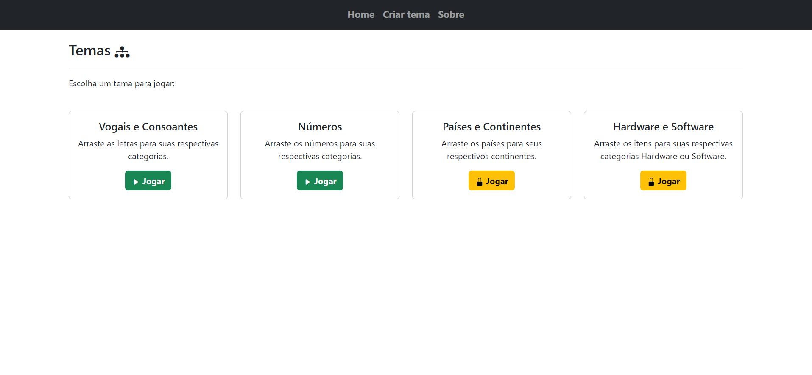
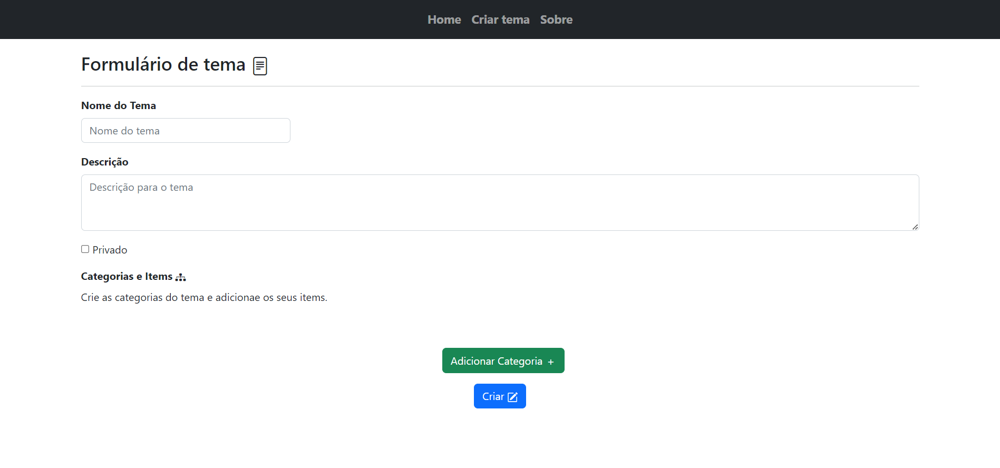
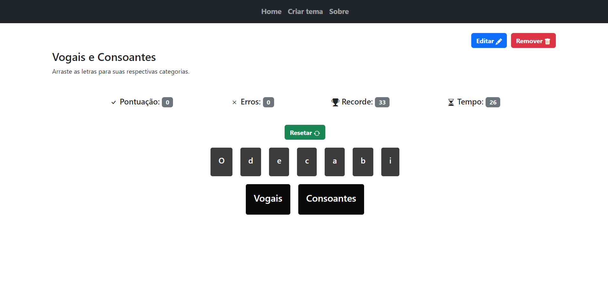
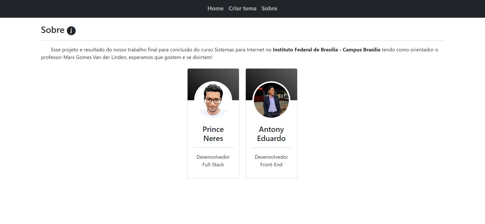

## Sobre

Esse é um sistema resultante do TCC para conclusão do curso de Sistemas para Internet que tem como título Jogo educacional de Associação de Coneitos.

## Telas

<h3 align="center">Tela inicial</h3>

  

<h3 align="center">Formulário de temas</h3>

  

<h3 align="center">Tela de jogo</h3>

  

<h3 align="center">Sobre</h3>

  

## Tecnologias usadas:

### Backend

- [Flask](https://flask.palletsprojects.com/en/2.2.x/)

### Frontend

- [jQuery](https://jquery.com/)
- [Bootstrap](https://getbootstrap.com/)

### Banco de Dados

- [MongoDB](https://www.mongodb.com/docs/manual/reference/program/mongod/)

## Como rodar

No diretório do projeto execute os seguintes comandos:

`python3 -m venv venv`  
`. venv/Scripts/activate`  
`pip install -r requirements.txt`  
`python app.py`

### Docker

`docker run -p 3000:3000 drag-and-drop`
`docker build -t drag-and-drop .`
